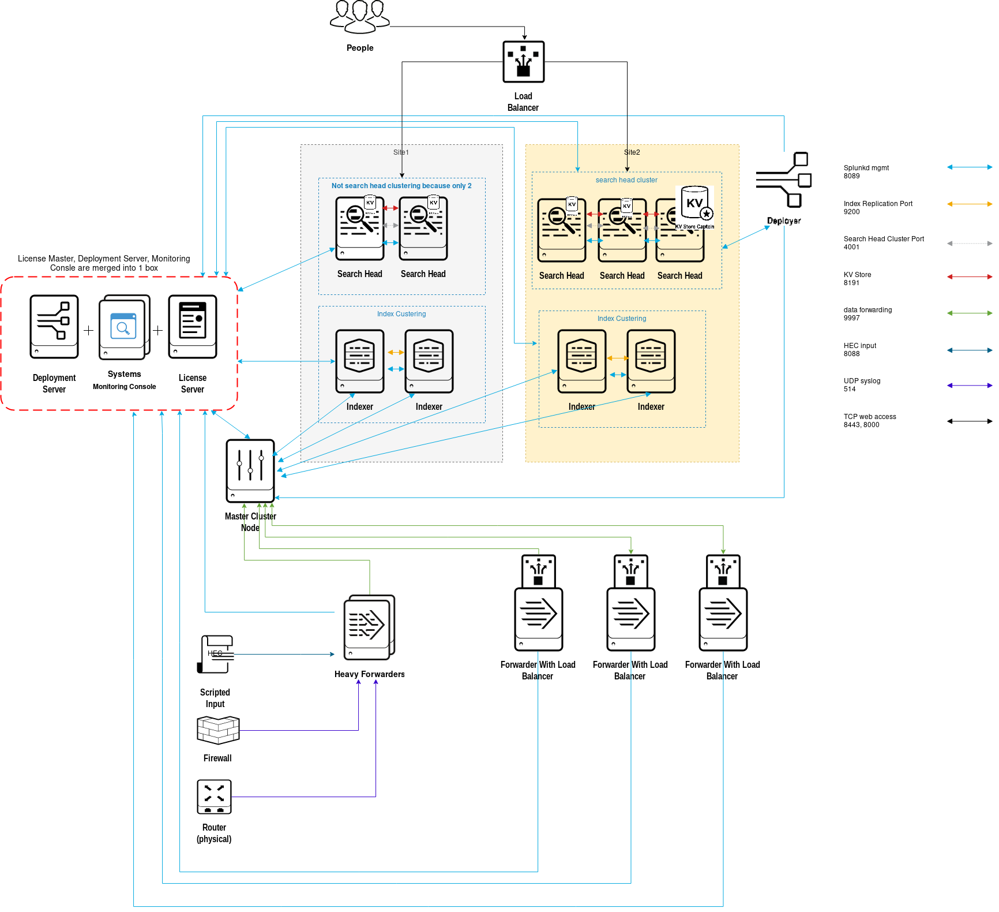
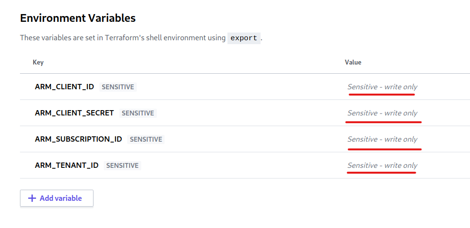
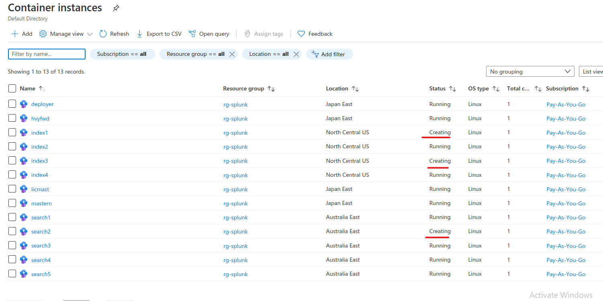
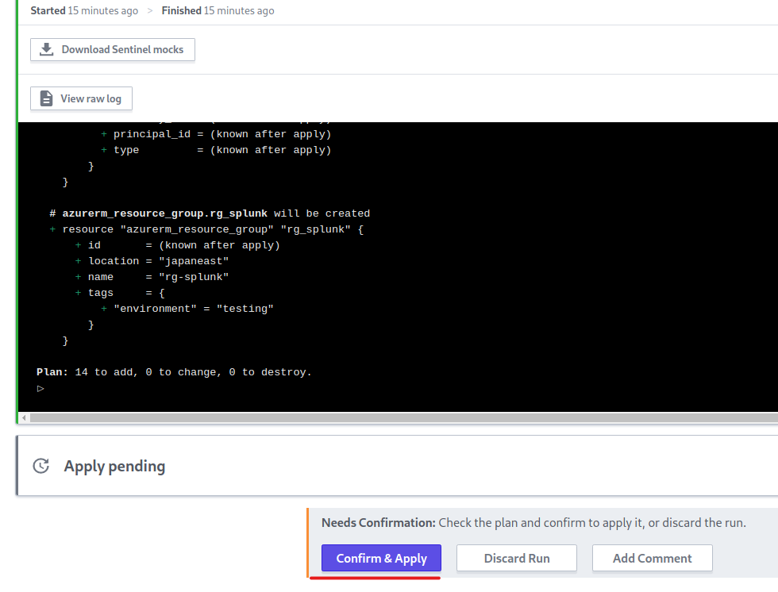

# Proof-of-concept: Prepare a Splunk test cluster environment in Azure and demonstrate the keyvault management via Terraform Cloud

This article covers 2 topics: 
1. Build a Splunk test environment with 13 Azure Container Instances (ACIs) using Terraform
2. Terraform Cloud key management

What are **NOT** covered in this article:
1. How to cluster bundle all Splunk instances together
2. Basic commands of Azure, Terraform, Splunk
3. How to set up Azure NSG and firewall
4. How to set up persistent volume


## Introduction
This is for proof-of-concept of preparing a test environment of Splunk clustering by creating 13 ACIs (Azure Container Instances) in Azure Icloud. Each container has pulled the public image of latest version of Splunk standalone version. All ip addresses are external-facing and using Azure public DNS to resolve ip address, which is easily accesible by your customers. Azure's access key will be stored in Terraform Cloud to authenticate with Azure account.

Each Azure region only allows up to 10 cpus for creating ACI, therefore index clustering and search head clustering are created in separate region. These can be modified by local variable.
location_idxc
location_shc

Below is the architecture diagram where license-master also acts as deployment server and monitoring console. The sample architecture diagram is a typical SVA M14 (multi-sites and indexer+search head clustering). Terraform template is scalable to fit your test environment by increasing or decreasing the numbers of containers, or even split up more roles of standalone instance. More samples of Splunk validated architecture (SVA) can be refer to document: https://www.splunk.com/pdfs/technical-briefs/splunk-validated-architectures.pdf.



Total 13 containers will be created from Terraform template:
Instance | Amount | Container Hardware | Opening Ports | Region
-------- | ------ | ------------------ | ------------- | ------
license master + monitoring console + deployment server combine into 1 box | 1 | cpu 2 ram 2gb | 8000 8089 | Japan East
deployer | 1 | cpu 2 ram 2gb | 8000 8089 8191 | Japan East
search head and captain | 5 | cpu 2 ram 2gb | 8000 8089 8191 replication: 4001 | Australia East
master node | 1 | cpu 2 ram 2gb | 8000 8089 | Japan East		
indexer | 4 | cpu 2 ram 2gb | 8000 8089 replication: 9200  s2s:9997 | North Central US
heavy forwarder | 1 | cpu 2 ram 2gb | 8000 8089 udp514 hec:8088 | Japan East


Login username and password for all Splunk instances are `changeme`. This can be modified under variables.tf and "login_password".


## Pros and Cons about building a test environment in Azure ACI
#### Pros:
* Quicker and easier to spin up a bunch of containers than AKS (Azure Kubernetes Service)
* Easily destroy the entire environment with command `terraform destroy --auto-approve`
* All containers have external public ip so that you can demonstrate your architecture plan to your customers, however you may spend extra work to harden the environment with Azure NSG and firewall which aren’t covered in this article. Azure Firewall is actually quite expensive too keep it running all the time. 
* Each container can be accessed easily with Azure cloud shell, no need to set up SSH key like AWS does.
* Azure real-time log analysis is more intuitive
* It’s a pain in the butt to get Terraform Vault working to securely store your IAM keys or Azure keyvaults. Terraform Cloud has an online keyvault feature which is more intuitive to set up and can work across multiple devices because the keys are stored in the cloud. We entrust Terraform Cloud to keep the keys safe. If it were a production environment, it’s highly recommended to set up Terraform Vault and keep your IAM keys on-prem. There are several other methods to control Terraform Cloud sets up Azure keyvault, further reading is at https://cloudskills.io/blog/terraform-azure-04.

#### Cons:
* Since all ACIs are external facing, **do not** ingest production data in the test environment, or you have to sanitize your data before ingesting in. You can disable web GUI for indexers at the backend with command `./splunk disable webserver` at _/opt/splunk/bin_ directory
* If you want to scale up for more ACIs, edit the Terraform main.rf template to scale up more containers in different Azure regions. Each Azure region only supports up to 10 CPU cores running, and since each container takes 2 cpu cores, maximum 5 ACIs can be run per region. 
* Not every region supports container group. For the availability, refer to document: https://docs.microsoft.com/en-us/azure/container-instances/container-instances-region-availability
* Each Azure region charges container group per hour differently, EAST US 2 seems to be the cheapest. Price can be compared at https://azure.microsoft.com/en-au/pricing/details/container-instances/
* Horizontal scaling isn't as flexible as kubenetes pods
* Harder to create persistent volume than kubenetes PVC. Not going to cover in this article


## Pre-requisite
1. You need to register an Azure account. https://portal.azure.com, install Azure CLI locally
2. You need to register a Terraform Cloud account. https://app.terraform.io/
3. Azure CLI can be run on local or on cloud shell
4. Highly recommended to set multi-factor authencation to Azure and Terraform accounts


## How to run Terraform template
1. Install the latest version of Terraform binary. https://www.terraform.io/downloads.html. By the time this article was written, I was using Terraform version 0.13.4
2. Azurerm version is , more Azure provider commands can be found from https://registry.terraform.io/providers/hashicorp/azurerm/latest/docs
3. Log in Terraform Cloud, create a new Workspace
4. Make a name for your new Workspace, choose the second option “CLI-driven workflow”
5. Main.tf is using Terraform remote backend to managing subscription-id and tenant-id to connect to Azure cloud, therefore you will need to modify the first stanza in main.tf to login Azure. Open main.rf, edit the backend stanza to suit your Terraform Cloud’s organization name and workspace name. Below is an example:

```
terraform {
  backend "remote" {
    organization = "<your terraform cloud username>"

    workspaces {
      name = "tf-splunk-az"
    }
  }
}
```

6. Since test environment is disposable and it doesn’t worth the effect to set up Terraform Vault on-prem. Terraform Cloud provides an easy solution to store Azure keys. 

    Run `az account show` command in Azure CLI to check your tenant id.
    Run this command to get `az ad sp create-for-rbac -n "TerraformSP" --role contributor --scopes /subscriptions/<your id>`. **id is your subscription id, not the tenant id.**. This command means that configuring the service principal with contributor rights at the root of the subscription. It's convenient to do in a test environment but not a best practise to do in a production environment. 
    
    The result should be similar to
    ```
    {
        "appId": "73340a90-5cf7-49fa-a596-87692fa6a8b6",
        "displayName": "TerraformSP",
        "name": "http://TerraformSP",
        "password": "SbkLDBITXpQRCahwVb_jV4rIvHeON4JhsU",
        "tenant": "53c4e8cf-11c1-4455-a96e-4051e3c42137"
    }
    ```
    Login Terraform Cloud on https://app.terraform.io/ and open your workspace. In Terraform's environment variable names should be corresponding to:
    ```
    ARM_CLIENT_ID="73340a90-5cf7-49fa-a596-87692fa6a8b6"         (appId)
    ARM_CLIENT_SECRET="SbkLDBITXpQRCahwVb_jV4rIvHeON4JhsU"       (password)
    ARM_SUBSCRIPTION_ID="59110615-c3e2-4cfc-8c4d-a0f9765fbdee"   (subscription id)
    ARM_TENANT_ID="53c4e8cf-11c1-4455-a96e-4051e3c42137"         (tenant id)
    ```
7. Go back to Terraform Cloud and open your Workspace, on the menu bar, click on Variables. 
    Terraform Variable can replace your local variables.tfvars, that’s where you put in Azure subscription id and tenant id
    Environment Variables allows the backend connecting and authenticating with Azure. Manually type in environment variables. Set the key to sensitive so that nobody can read the value even if your Terraform Cloud account is compromised. 


8. Then can run the commands like `terraform init`, `terraform plan`, `terraform apply` locally.


## Variables
- Can scale up or down the numbers of search head or indexer by going into variables.tf, under "searchhead_clustering" and "index_clustering" to add more sh{number} and idx{number}. Maximum is 5 on each because the limitation of available CPU cores in each Azure region. 


## Troubleshootings
1. Sometimes Azure gets stucked in creating container, you have to manually delete the container and then run `terrform apply` again. 

2. Data and config don't stay when the container is destroyed. But can be workaround with storage-account. 

3. If terraform encounters problem like `Error parsing json result from the Azure CLI: Error launching Azure CLI: exec: "az": executable file not found in $PATH`  , probably your AZ Login contains multiple accounts. Confirm you have multiple accounts by `az account list`, you will need to set one as `az account set --subscription="SUBSCRIPTION_ID"`

4. Sometimes Azure may get stucked when creating the container. It shows the container as "Creating" or "Pending" status, and then you will need to manually delete the pending containers and re-run `terraform apply` again. 


5. When you `terraform apply`, you see message "Error: Apply not allowed for workspaces with a VCS connection". It means that your workspace has been synced with Github versioning control. You have to log in Terraform Cloud, go to 'Runs', find the "curent run" labeled with "Needs Confirmation" to manually click on 'Apply' button


