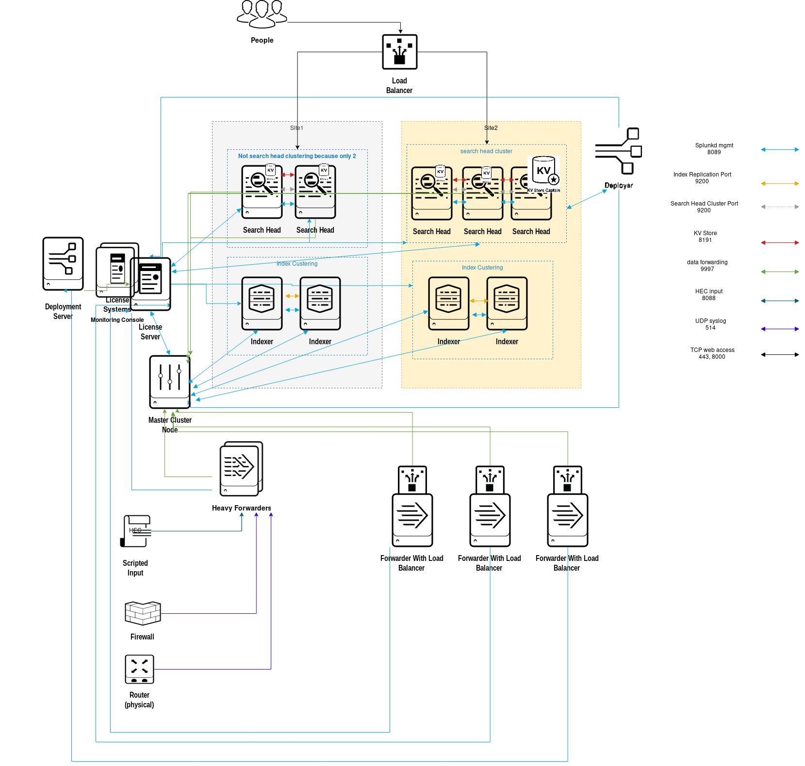

# splunk-azure

Pre-requisite knowledge: Terraform, Azurerm 2.0, Azure Fundamental

!!Caveat!!
This is for proof-of-concept of building a simulation of Splunk clustering architecture by creating 13 ACIs (Azure Container Instances) in Azure Infrastructure. All ip addresses are external-facing and using Azure public DNS to resolve ip address, hence DO NOT ingest any sensitive data or production logs into the indexers. 

Each Azure region only allows up to 10 cpus for creating ACI, therefore index clustering and search head clustering are created in separate region. These can be modified by local variable.
location_idxc
location_shc

Below is the architecture diagram where license-master also acts as deployment server and monitoring console

